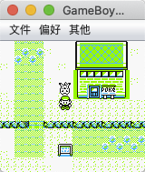
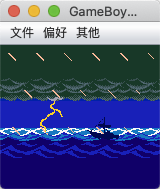
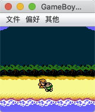
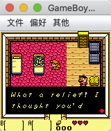
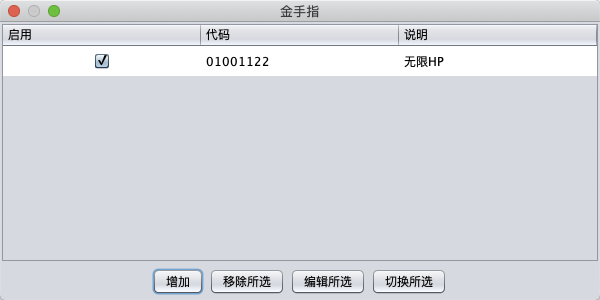
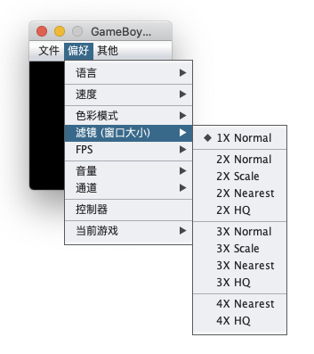

Game Boy Color Simulator
=========
A *Game Boy Color* Simulator, only written with JAVA-SE and all the hardware is virtualized as the object. Through my continuous improvement, it has been able to run a lot of games.

Cheats
-----

First, get many cheats from [GameHacking](https://gamehacking.org/?sys=gb) (More in version USA).

| NAME | FORMAT | DESCRIPTION |
| ---- | ---- | ---- |
| RAW | HHLL:DD | MOCK RAM indexOf 0xHHLL to DD |
| RAW | HHLL?II:DD | MOCK RAM indexOf 0xHHLL to DD when it is II |
| GameShark | 01DDLLHH | MOCK RAM indexOf 0xHHLL to DD |
| Codebreaker | 00HHLL-DD | MOCK RAM indexOf 0xHHLL to DD |

Setting cheats in menu when you open the game.

Accelerate
----

Filters
----

Features
----
- [x] Simulate GB/GBC/SGB
- [x] Accelerate
- [x] Snapshot Save and Load
- [x] Cheats
- [x] Filters and zoom
- [x] Change devices

参考
----
- [MeBoy](http://www.arktos.se/meboy/)
- [JavaBoy]
