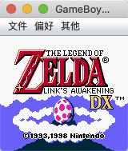

GBC模拟器
=========
一个GBC模拟器, 使用Java1.6编写. 

他可以完美模拟大部分GB/GBC游戏, 还可以使用画面滤镜, 调色板, 变速器, 金手指.

金手指
-----

从 [GameHacking](https://gamehacking.org/?sys=gb) 可以获得游戏的金手指, 大部分是美版的, 支持以下格式

| 名称 | 格式 | 说明 |
| ---- | ---- | ---- |
| RAW | HHLL:DD | RAM的第HHLL位数据改为DD |
| RAW | HHLL?II:DD | RAM的第HHLL位数据如果是II改为DD |
| GameShark | 01DDLLHH | RAM的第HHLL位数据改为DD |
| Codebreaker | 00HHLL-DD | RAM的第HHLL位数据改为DD |

打开游戏之后调出金手指进行代码输入和应用

变速
----

滤镜
----

功能
----
- [x] 模拟GB/GBC/SGB游戏
- [x] 游戏加速
- [x] 及时存档
- [x] 金手指
- [x] 滤镜以及缩放
- [x] 改变机型

参考
----
- [MeBoy](http://www.arktos.se/meboy/) 的CPU设计
- [JavaBoy]的声卡设计
